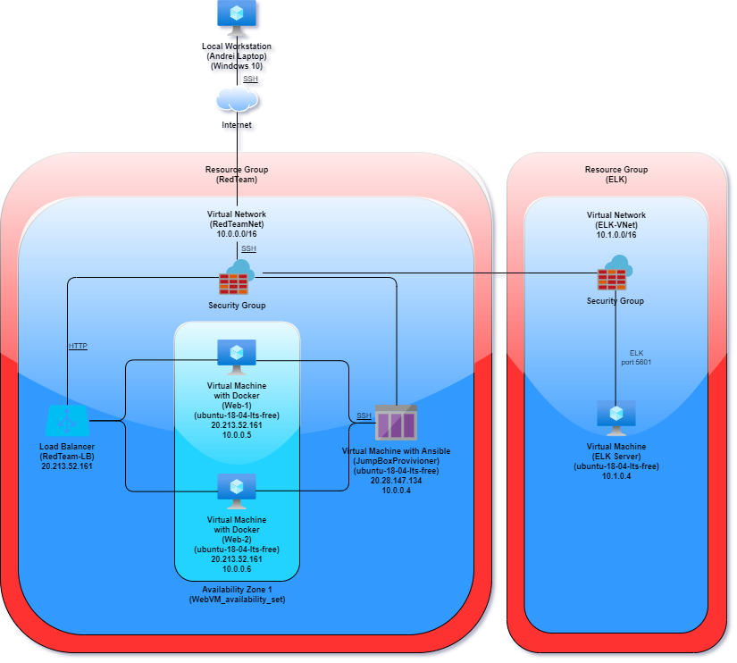
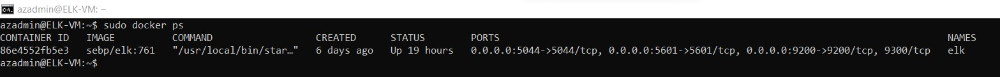

# Cyber-Security

University of Sydney - Cyber Security Bootcamp

## Automated ELK Stack Deployment

The files in this repository were used to configure the network depicted below.





These files have been tested and used to generate a live ELK deployment on Azure. They can be used to either recreate the entire deployment pictured above. Alternatively, select portions of the Ansible playbook file may be used to install only certain pieces of it, such as Filebeat.


  - [Ansible ELK install playbook](Ansible/install-elk.yml)


This document contains the following details:
- Description of the Topology
- Access Policies
- ELK Configuration
  - Beats in Use
  - Machines Being Monitored
- How to Use the Ansible Build


### Description of the Topology

The main purpose of this network is to expose a load-balanced and monitored instance of DVWA, the D*mn Vulnerable Web Application.

Load balancing ensures that the application will be highly available, in addition to restricting unauthorised access to the network.


Integrating an ELK server allows users to easily monitor the vulnerable VMs for changes to the logs and system files.


The configuration details of each machine may be found below.


| Name     | Function | IP Address | Operating System |
|----------|----------|------------|------------------|
| Jump Box | Gateway  | 10.0.0.4 | Linux |
| Web-1    | webserver/docker container | 10.0.0.5 | Linux |
| Web-2     | webserver/docker container | 10.0.0.6 | Linux |
| ELK-VM    |    ELK Stack      | 10.1.0.4 | Linux |

### Access Policies

The machines on the internal network are not exposed to the public Internet. 

Only the Jumpbox machine can accept connections from the Internet. Access to this machine is only allowed from the following IP addresses: **49.189.250.115**


Machines within the network can only be accessed by the Jumpbox private IP address: **10.0.0.4**

A summary of the access policies in place can be found in the table below.

Inbound Policies: 

| Name     | Publicly Accessible | Allowed IP Addresses | Allowed Ports |
|----------|:-------------------:|:--------------------:|:-------------:|
| Jump Box | No | 102.165.47.135 | 22 |
| Jump Box | No | 10.0.0.4 | 22 |
| Load Balancer | No | 102.165.47.135 | 80 |
| ELK Web Server | No |  102.165.47.135 | 5601 |


### Elk Configuration

Ansible was used to automate configuration of the ELK machine. No configuration was performed manually, which is advantageous because it automates the configuration and deployment process, saving time and performing a uniform deployment that prevents errors.


The playbook implements the following tasks:
- Install Docker
- Install Python3-pip
- Configure VM with DVWA
- Download and launch a docker web container
- Enables Docker service


The following screenshot displays the result of running `docker ps` after successfully configuring the ELK instance.



### Target Machines & Beats
This ELK server is configured to monitor the following machines:

- **Web-1** 10.0.0.5
- **Web-2** 10.0.0.6

We have installed the following Beats on these machines:
- Filebeat
- MetricBeat

These Beats allow us to collect the following information from each machine:
- **Filebeat:** helps collect and logs information about the file system; It will be used to monitor the Apache server and MySQL database logs generated by DVWA.

- **Metricbeat:** periodically collects metrics from the operating system and from services, it takes the metrics and statistics that it collects and ships them to Kibana for easy visualisation.


### Using the Playbook
In order to use the playbook, you will need to have an Ansible control node already configured. Assuming you have such a control node provisioned: 

SSH into the control node and follow the steps below:
- Copy the ***install-elk.yml*** file to ***./etc/ansible/.***
- Update the hosts file to include ***10.0.0.5*** and ***10.0.0.6*** for webservers, and 
***10.1.0.4*** for ELK
- Run the playbook, and navigate to **“http://20.28.147.134:5601/app/kibana”** to check that the installation worked as expected.

---

#### Commands needed to run to download the playbook, update the files, etc:


- Command to install Docker:
```bash
sudo apt install docker.io
```


- Command to update Linux applications:
```bash
apt-get update
```


- Command to download the docker container image we use:
```bash
sudo docker pull cyberxsecurity/ubuntu:bionic
```

- Command to launch the downloaded Docker container we will use:
```bash
sudo docker run -ti bionic/ubuntu bash
```


- Command to start the Docker container:
```bash
sudo docker start [container name]
```


- Command to attach the container:
```bash
sudo docker attach [container name]
```

